# 最新电力比价平台完整榜单(内附价格对比)

每个月电费账单来的时候总是心里一紧,看着那串数字不知道到底有没有被多收钱,换个电力供应商又怕更贵或者流程复杂。现在美国很多州实行电力市场开放政策,消费者可以自由选择电力供应商,但面对几十家公司上百种套餐,条款费率五花八门,光看就头疼。这些电力比价平台能帮你在几分钟内比较所有可用方案,展示真实包含所有费用的价格,有的还能根据你的实际用电量推荐最省钱的套餐。这篇文章整理了15个主流电力比价平台,从覆盖区域到功能特点都给你讲清楚。

***

## **[ComparePower](https://comparepower.com)**

专注德州市场的电力比价平台,提供透明的全包定价和快速在线签约服务。

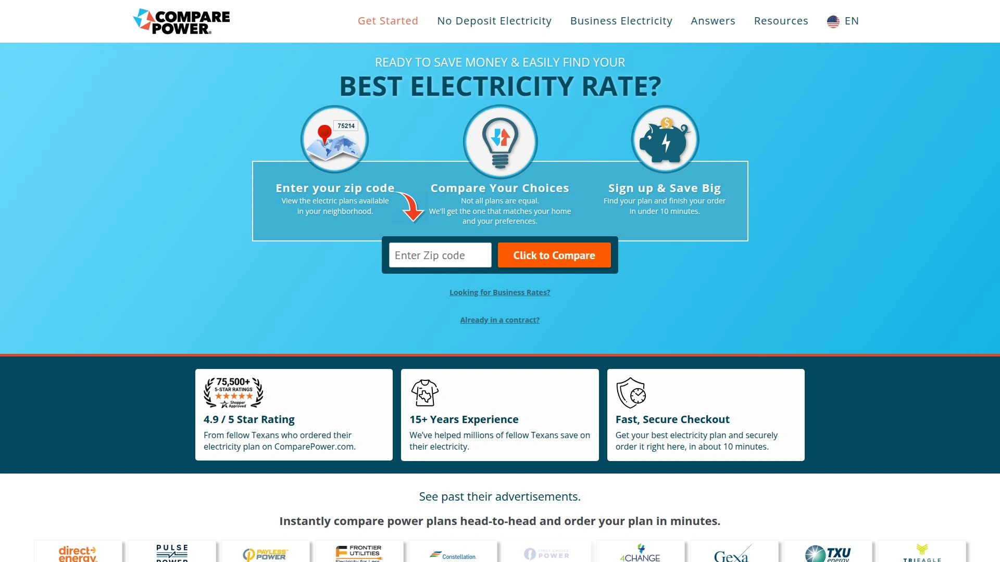

运营超过15年,已经帮助数百万德州居民节省电费开支。最大的特色是强制要求所有列出的电力供应商必须展示"全包定价",这个价格包含了所有能源费用和配送费用,你在账单上看到的就是这个数字,不会有隐藏收费。

**使用体验很直观:** 输入邮编就能看到你所在区域所有可用的电力套餐。可以根据实际用电量查看真实成本定价,每个套餐的细节信息都能直接在网站上查看,不需要跳转到别的地方。提供过滤和排序功能,快速找到适合你的方案。

整个流程从比较到下单能在10分钟内完成,结账过程快速且安全。平台在德州居民中获得4.9/5星的高评分。无论你是想找最便宜的电价省钱,还是想选择可再生能源发电的绿色套餐,都能在一个地方完成比较和订购。

特别适合德州地区的家庭用户和小型企业,界面清晰易懂,价格透明,没有套路。帮助消费者看穿电力公司广告背后的真实成本,做出明智选择。

***

## **[EnergyBot](https://www.energybot.com)**

智能化电力比价工具,直接连接你的公用事业账户获取实际用电数据。

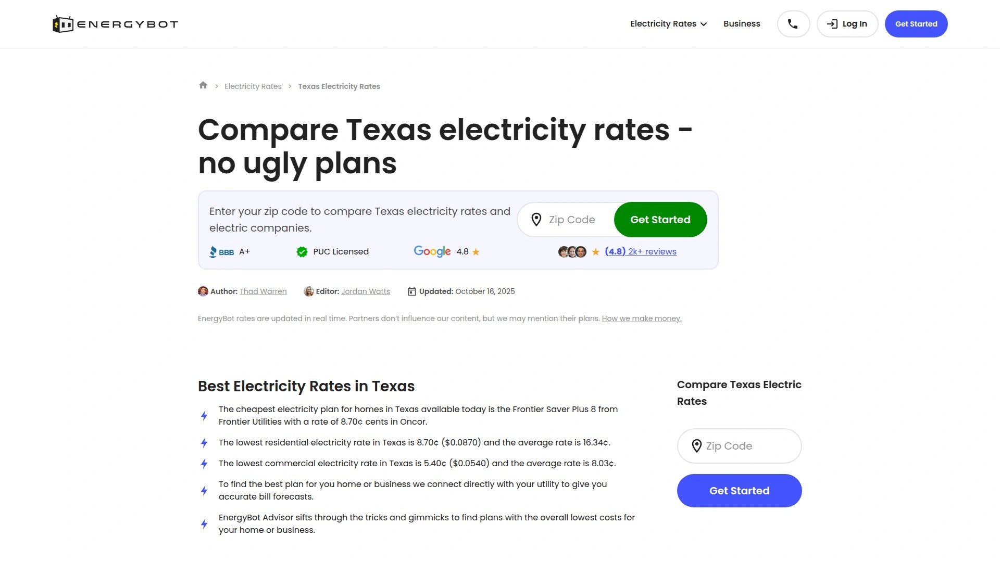

这个平台最大的创新是能直接链接到你的水电公司账户,读取你的真实用电历史数据,然后基于这些数据推荐最适合你的套餐。不需要自己估算用电量或者翻找旧账单,系统自动帮你完成这些工作。

5分钟内就能找到并注册最佳电力套餐,整个过程顺畅简单。没有隐藏费用,没有令人困惑的条款,只提供清晰、客观的选项帮你做更明智的能源选择。

用户反馈显示,通过EnergyBot找到的套餐都是基于实际用电情况,而不是那种"假设你每月用1000度电"的笼统估算。工具简单易用,界面干净,不会给你一堆无关的信息。适合休斯顿、达拉斯等德州主要城市的居民和商业用户。

团队由能源专家、技术人才和市场专业人士组成,致力于让电力购物变得快速且容易理解。客户支持团队随时准备帮助解决问题。

***

## **[ElectricityRates.com](https://electricityrates.com)**

覆盖多州的电力比价网站,合作超过35家领先电力供应商。

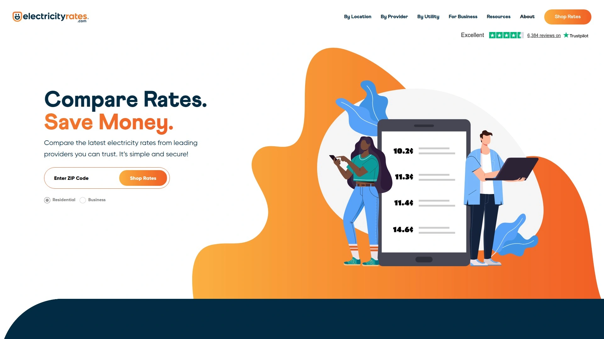

帮助超过20万客户成功切换电力供应商,潜在节省幅度可达35%以上。在Trustpilot上有超过5000条评价,评分4.7星,被称为"优秀"级别。

提供最新透明的电价信息,没有隐藏费用。切换流程简单安全,只需三步:输入邮编比较你所在区域的电价、根据具体需求比较供应商和套餐、切换电力供应商并开始省钱。

强调透明度和选择权,让用户能够避免电价上涨,做出可持续的能源选择。找到符合你需求的套餐,用数据支持做出明智决策。覆盖美国多个实行电力市场开放的州。

---

## **[ChooseEnergy](https://www.chooseenergy.com)**

运营超过15年的能源比价平台,服务超过200万客户。

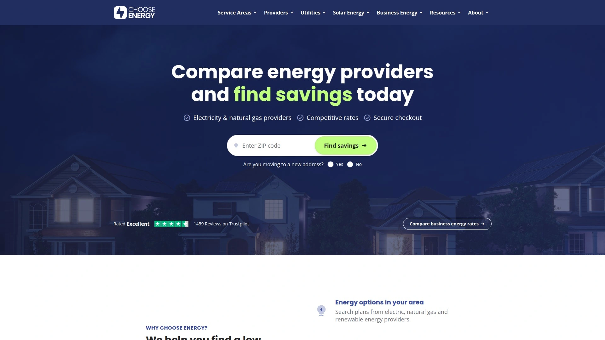

覆盖15个州的电力、天然气和可再生能源供应商。用户可以搜索、比较、注册并节省费用,整个过程完全免费。

**核心优势:** 提供当日最优电价信息,定价透明无隐藏费用。安全可靠的流程,选择适合你的套餐后可以安全完成购买。潜在节省幅度约30%。

跟全美各地的本地能源供应商建立合作关系。在Trustpilot上评分4.6/5星,被评为"优秀"。用户评价显示,平台帮助他们找到了适合房屋大小和预算的合适套餐,比较信息全面,注册流程简单快捷。

还提供太阳能成本和节省估算服务,如果你考虑投资太阳能板,可以免费在线获取估算。定期发布能源相关的指导文章,帮助用户做出明智的能源选择。

***

## **[PriceToCompare](https://www.pricetocompare.com)**

在线能源市场平台,提供并排套餐比较功能节省时间。

帮助成千上万满意客户每年在能源账单上节省数百美元。提供多样化的电力、天然气、可再生能源和商业能源服务。

**服务范围包括:** 电力套餐——比较顶级能源供应商的实惠电价,找到适合家庭或企业能源需求的套餐。天然气套餐——发现最具成本效益的天然气价格和套餐,全年保持低能源账单。可再生能源——探索最佳可再生能源供应商和套餐,同时降低电费和碳足迹。商业套餐——通过量身定制的电力或天然气套餐节省更多商业能源费用。

使用流程简单:输入地址解锁你所在区域最佳能源价格和套餐,仔细审查每个套餐的条款、价格和细节确定最适合需求和预算的方案,完全在线完成注册,五分钟内开始节省能源成本。

提供简化的并排套餐比较功能,帮你快速找到理想的能源套餐。提供灵活的电力或天然气套餐,匹配你的生活方式和预算。

***

## **[PowerWizard](https://www.powerwizard.com)**

创新的电力套餐比价工具,提供持续市场监控和自动化管理服务。

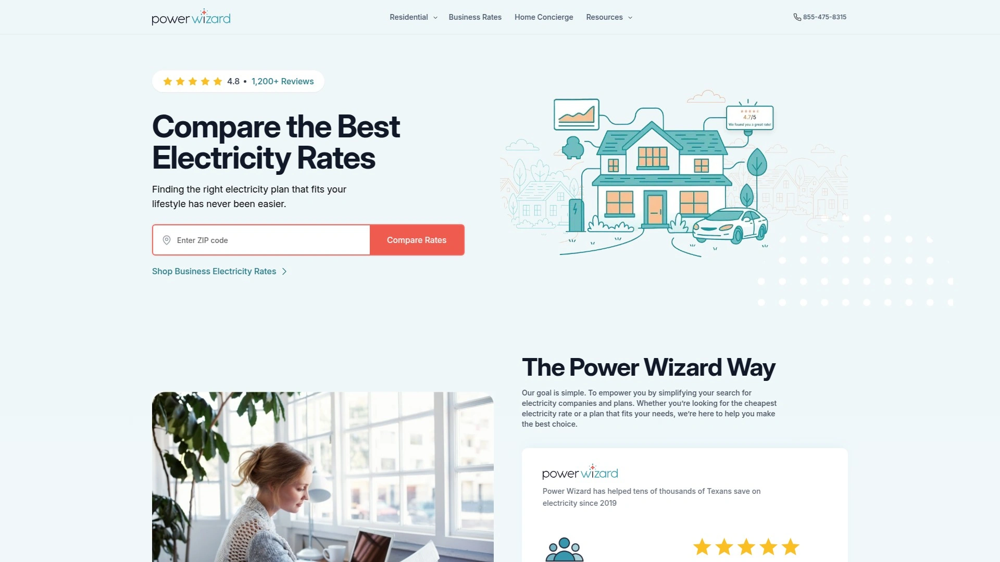

不同于其他只是帮你找套餐的平台,PowerWizard提供两种会员计划:Silver DIY和Gold VIP。Silver DIY是一次性收费14.95美元,提供核心功能包括电力套餐搜索和持续市场监控。创新技术能在几秒钟内比较数百个电力套餐,过滤掉不良和噱头选项,只展示最好的方案。

Gold VIP会员每月10美元,除了所有Silver功能外,还提供免手动注册服务——PowerWizard会处理新电力套餐的注册和当前套餐的取消。合同提醒功能让你不用追踪合同到期日期,快到期时系统会提醒你。最强大的是"始终获得最佳套餐"功能,PowerWizard会处理续约或取消并替换为更好的套餐,无论哪个更省钱。

通过分析你的电力使用情况并提供个性化建议,帮助优化能源消耗并降低账单。你在电费账单上享受的节省可能超过PowerWizard会员费,使其成为值得的投资。适合想要完全自动化管理电力套餐、不想每年自己去比较和切换的用户。

***

## **[ElectricityPlans.com](https://electricityplans.com)**

专注德州市场的电力比价网站,拥有30多年行业经验支持。

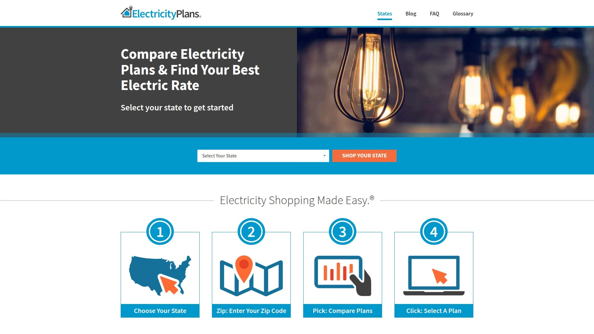

帮助德州家庭和企业轻松评估可用的电力套餐和电力供应商。德州超过85%的居民和企业可以自由选择电价和供应商,这是放松管制的结果。公用事业供应商(如达拉斯的Oncor或休斯顿的CenterPoint)继续处理电力配送和应急响应,但你可以从40多家电力供应商和数百个涵盖不同价格、条款和优惠的电力套餐中选择。

团队会审查细则,帮助你购物德州能源套餐,找到德州最便宜的电价。购物流程:先比较电价,输入邮编找到你所在区域最佳电价。然后输入平均月用电量,查看每个套餐的估算账单和平均价格。从固定费率到太阳能回购、免费夜间电力等类型中选择。

提供套餐比较工具,可以在不同使用场景下并排查看价格,甚至可以把结果通过电子邮件发送给自己。需要帮助决策?可以阅读他们的德州电力套餐评论。适合想要深入了解套餐细节、做充分研究的德州用户。

***

## **[PowerSetter](https://www.powersetter.com)**

成立于2014年的能源比价平台,已帮助超过25万客户降低能源账单。

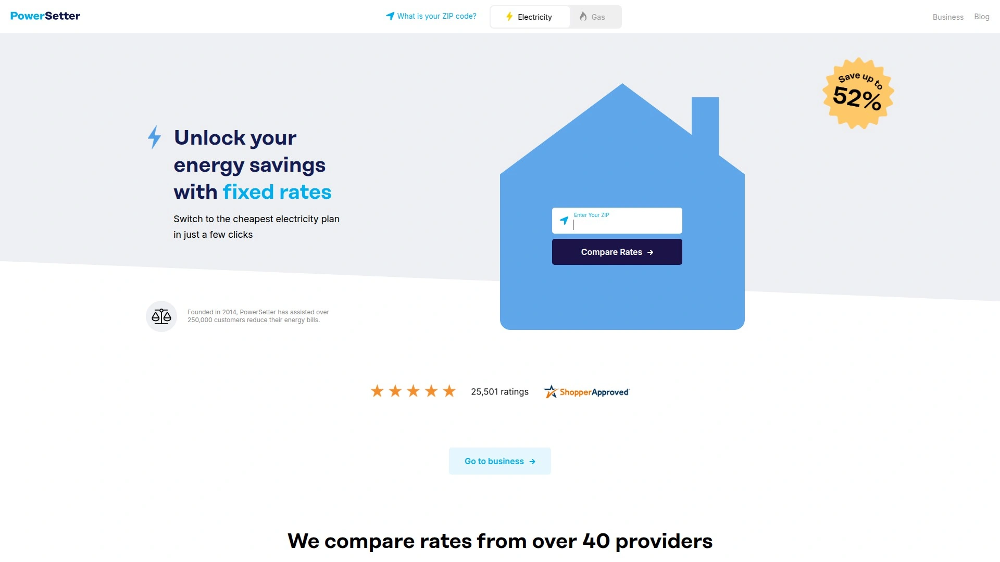

运营超过11年,在多个放松管制的州提供服务,包括康涅狄格、宾夕法尼亚、俄亥俄、马萨诸塞、缅因、伊利诺伊、新泽西、德州、乔治亚、新罕布什尔等。

使用流程简单:输入邮编、比较所有报价、切换到最便宜的一个。当套餐到期时,可以轻松返回、比较套餐并再次切换到最实惠的选项。

**平台优势:** 能源供应商提供多样化的能源选择,包括可再生绿色能源和固定费率套餐,扩大了传统公用事业之外的消费者选择。电力放松管制使居民和企业能够轻松在线比较和切换供应商,确保最优节省。

PowerSetter作为领先的数字能源比价平台,通过选择没有隐藏费用的套餐并与值得信赖的替代能源公司合作,确保透明度和可靠性。享受比本地公用事业公司更低的电力和天然气价格,节省月度能源开支。选择太阳能或风能等绿色电力选项,为环境可持续性做贡献。潜在节省高达52%。

***

## **[SaveOnEnergy](https://www.saveonenergy.com)**

免费直观的能源市场平台,提供能源公司比较和经济实惠的价格注册。

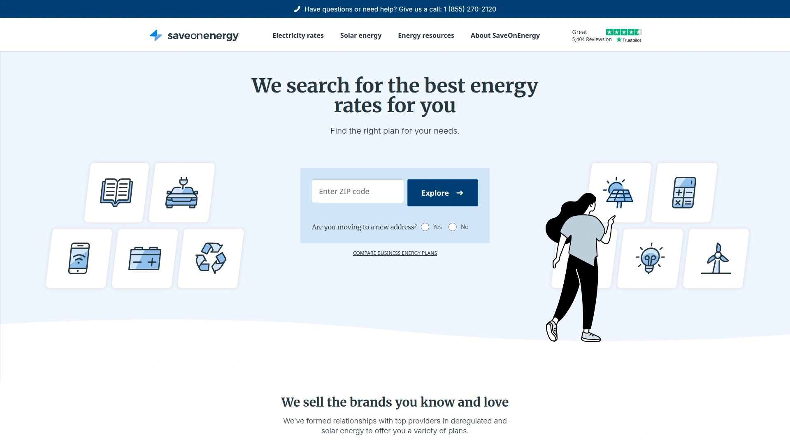

覆盖多个州,提供电力和天然气供应商的比较服务。市场平台设计简洁,所有操作都在一个地方完成,省时省力。

按州提供电价信息,定期更新2025年10月最新数据。帮助用户购物电价,找到最佳套餐、价格和供应商。

与顶级能源公司合作,确保用户能够访问可靠且有竞争力的能源选项。提供能源新闻和资源,帮助消费者了解市场动态和节能技巧。

适合寻求简单比较工具并希望快速找到负担得起的能源套餐的家庭和企业用户。

---

## **[ElectricChoice.com](https://www.electricchoice.com)**

独立在线比价服务,提供详细的各州电价信息和节省计算器。

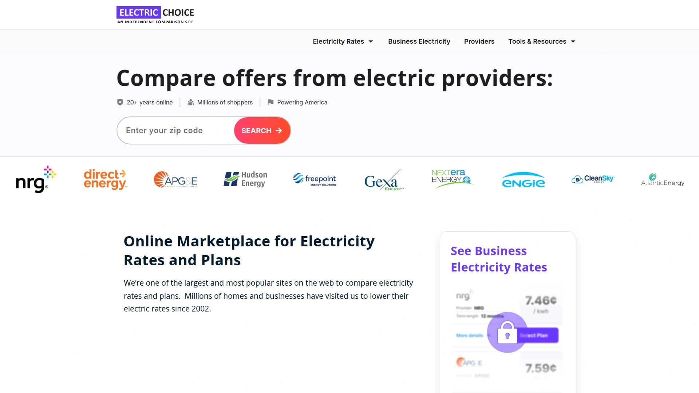

作为独立平台,不受任何单一能源供应商控制,提供客观的比较服务。覆盖多个实行电力市场开放的州,包括德州、俄亥俄、宾夕法尼亚等。

**节省计算器是一大特色:** 手动计算潜在节省很费时,特别是在比较多个报价时——ElectricChoice.com仅在德州、俄亥俄和宾夕法尼亚就提供数百个报价。计算器使用简单,输入当前电价、新电价和每月用电量,就会显示在月度、6个月、12个月、24个月和36个月基础上新电价能为你节省多少钱。

举例说明:假设你是德州居民,每月使用1300千瓦时电力,当前支付每千瓦时9.8美分,看中了每千瓦时8.6美分的新电价,计算器几秒钟就能告诉你切换后的节省金额。对于拥有或管理小企业的用户,比如宾夕法尼亚的汽车修理店每月使用11000千瓦时,从每千瓦时7.4美分切换到5.9美分,计算器同样能快速给出答案。

虽然还有更多因素(新月度账单上的费用/收费)可能影响实际节省,但节省计算器是在搜索新电价时的绝佳辅助工具。定期更新2025年10月最新电价数据。

***

## **[ChooseTexasPower.org](https://www.choosetexaspower.org)**

专注德州市场的电力比价平台,提供当日最优电力套餐列表。

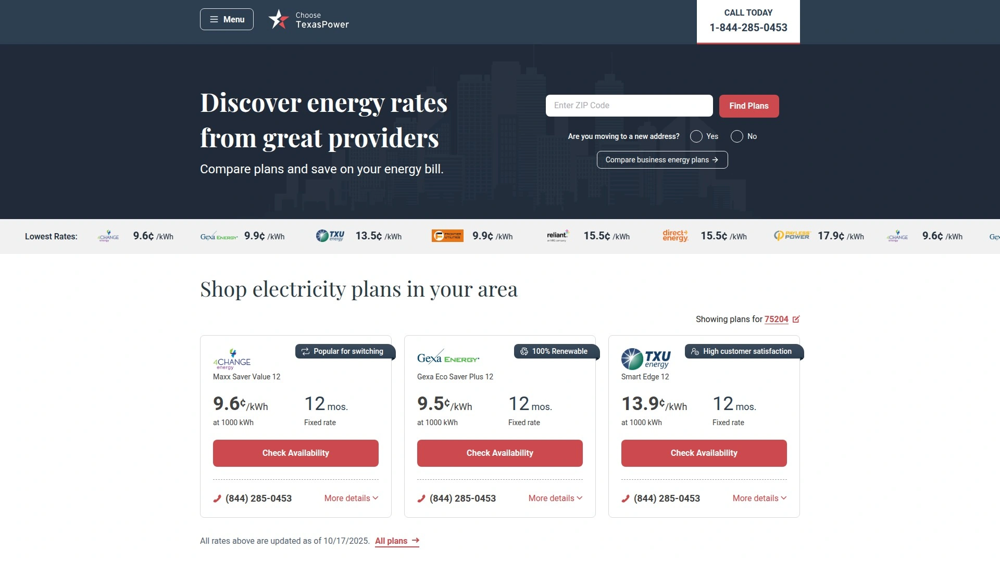

致力于提供一致可靠的能源套餐信息。展示当日德州能源套餐,包括供应商、期限和每千瓦时价格。例如当前展示的套餐从APG&E的10个月9.2美分/千瓦时到Payless Power的6个月预付费18.9美分/千瓦时。

涵盖主要德州电力供应商如APG&E、Frontier Utilities、Gexa Energy、Discount Power、Express Energy、Cirro、4Change Energy、Atlantex Power、Veteran Energy、TXU Energy、Constellation、TriEagle Energy、Reliant、Direct Energy、Rhythm Energy、Green Mountain、Payless Power等。

网站简洁易用,快速浏览可用选项。只需输入邮编就能找到完美的能源套餐。适合德州居民快速查看当前市场上的最佳电价选项。

***

## **[TexasPowerGuide.com](https://www.texaspowerguide.com)**

专注德州电力市场的比价指南网站,提供深入的套餐分析工具。

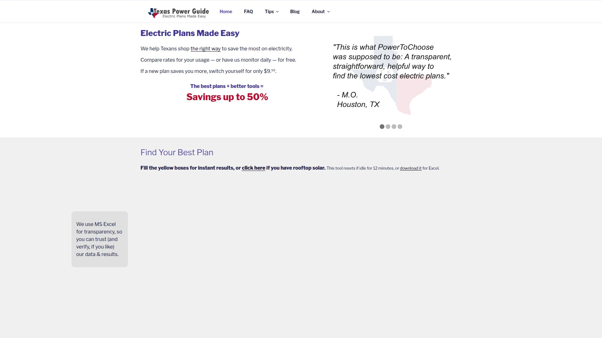

让德州电力套餐变得简单易懂。提供最佳德州电价指南,帮助消费者找到最划算的选项。

特别为太阳能用户提供电力套餐分析服务,这在行业里比较少见。拥有太阳能系统的家庭用户在选择电力套餐时有特殊考虑,TexasPowerGuide能提供针对性的分析。

提供套餐比较计算器,可以添加多个套餐进行详细对比。帮助用户理解如何购物德州电力,面对60多个零售电力供应商(REP)网站和30多个经纪商网站共同提供的海量选项。

适合想要深入了解德州电力市场、需要专业指导的消费者,特别是太阳能用户。

---

## **[PowerToChoose.org](https://www.powertochoose.org)**

德州公用事业委员会官方认证的电力比价网站。

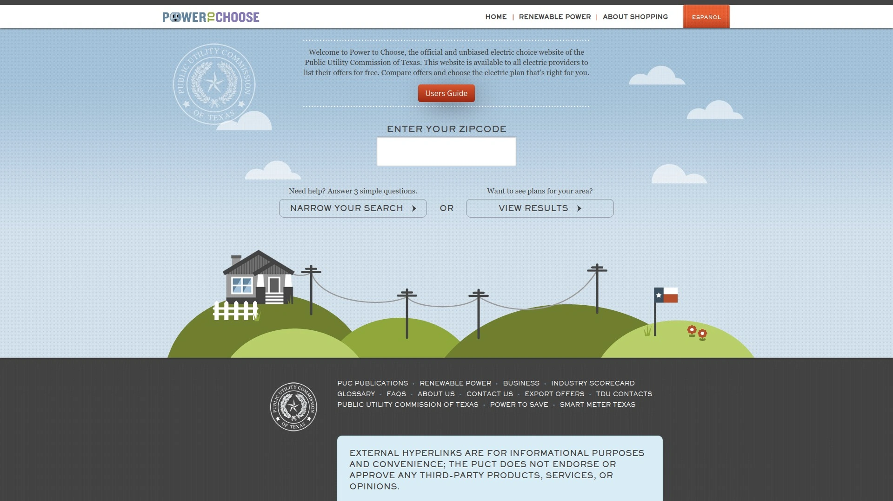

作为官方认证平台,提供权威可靠的电力套餐信息。覆盖德州所有实行放松管制的区域。

使用时需要输入邮编,对于有多个输配电公用事业公司(TDU)的邮编,需要选择一个TDU。例如邮编77001有多个TDU可选。

作为官方平台,数据更新及时准确,是德州居民比较电力套餐的权威来源。界面相对简洁,专注于提供基本的比较功能。

***

## **[PowerChoiceTexas.org](https://powerchoicetexas.org)**

德州电力选择平台,持续更新2025年10月最新套餐信息。

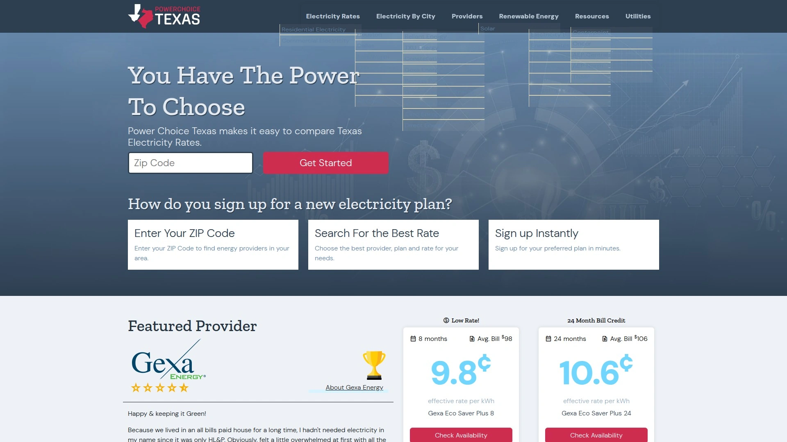

定期更新德州市场最新电力套餐和价格信息。帮助德州消费者行使"选择电力供应商的权力"。

专注于提供当前可用的最优电力套餐选项。适合想要了解最新市场动态和当前最佳价格的德州居民。

***

## **[EnergyBot Texas](https://www.energybot.com/electricity-rates/texas/)**

EnergyBot专门针对德州市场的电价比较服务页面。

德州实行放松管制的能源市场,意味着大多数德州人可以比较第三方电力供应商的电价和套餐,为家庭或企业找到最佳交易。

EnergyBot通过直接链接到公用事业数据简化德州能源价格比较,帮你点击按钮就能找到最佳套餐。可以在5分钟内使用平台切换电力供应商。

展示当前德州电价如APG&E的6个月期限13.39美分、Rhythm Energy的Simply Select 6套餐6个月13.49美分等。德州电价不是一刀切的,会根据你使用多少能源、住在哪里甚至一年中的时间而变化。

提供基于实际市场数据的当前电价平均值,帮你判断是否支付过高。比较你的电价与这些平均值,能更好地了解情况。

***

## **[PowerOutage.us Electricity Rates](https://poweroutage.us/electricity-rates)**

提供按州分类的电价信息和月度账单比较服务。

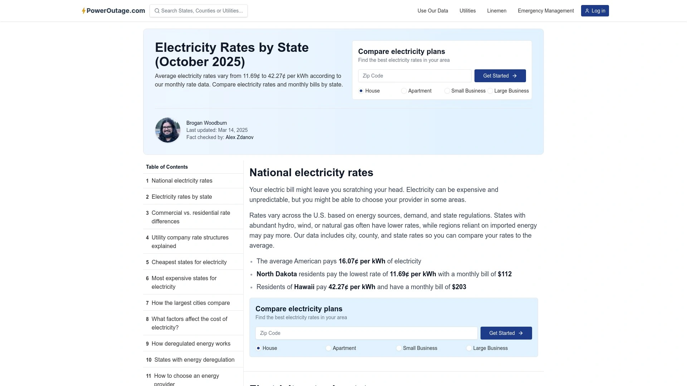

覆盖美国所有州,提供2025年10月最新电价数据。可以按州比较电价和月度账单。

除了电价比较,还提供电力套餐比较功能。帮助用户找到所在区域最佳电价。

界面简洁,快速查找各州电价信息。适合想要了解全国电价水平、进行跨州比较的用户。

---

## 常见问题

**电力比价平台是怎么运作的?**

这些平台跟多家电力供应商建立数据连接,当你输入邮编和用电量后,系统会自动从合作供应商那里拉取可用套餐和价格信息,然后展示给你比较。有些平台像EnergyBot能直接连接到你的公用事业账户读取真实用电历史,有些像ComparePower会要求供应商展示包含所有费用的真实价格。你在平台上选定套餐后,可以直接在线完成注册,平台会处理跟新供应商的对接和旧供应商的取消。整个过程通常5-10分钟就能完成。

**使用电力比价平台能节省多少钱?**

节省幅度因地区和个人用电情况而异,但通常在15-35%之间。ElectricityRates.com的数据显示潜在节省幅度可达35%以上,ChooseEnergy的平均节省约30%,PowerSetter声称用户可节省高达52%。实际节省取决于你当前支付的电价和找到的新套餐之间的差价。举例来说,如果你每月用1300千瓦时,从每千瓦时9.8美分切换到8.6美分,每月能省15.6美元,一年就是187.2美元。建议使用ElectricChoice.com的节省计算器具体算一下你的情况能省多少。

**哪些州的居民可以使用电力比价平台?**

美国有多个州实行电力市场放松管制政策,允许消费者自由选择电力供应商。主要包括德州(覆盖最广泛)、宾夕法尼亚、俄亥俄、伊利诺伊、新泽西、马萨诸塞、康涅狄格、缅因、新罕布什尔、乔治亚等州。德州超过85%的居民和企业可以自由选择电力供应商。不同平台覆盖的州有所不同,比如ComparePower、ElectricityPlans.com主要专注德州市场,而ChooseEnergy覆盖15个州,PowerSetter在11个以上的州运营。使用前最好确认平台是否覆盖你所在的州。

***

## 总结

选对电力比价平台能让你每年在电费上节省几百美元,从繁琐的套餐比较中解脱出来。不同平台各有特色,从自动化管理到详细计算器,从官方认证到智能数据连接,覆盖了消费者的各种需求。如果你在德州生活并且重视价格透明度和快速签约体验,[ComparePower](https://comparepower.com)通过强制要求全包定价和10分钟完成流程的设计,特别适合想要清晰了解真实成本、不想被隐藏费用坑的消费者,15年的运营经验和4.9星高评分也证明了它的可靠性。
